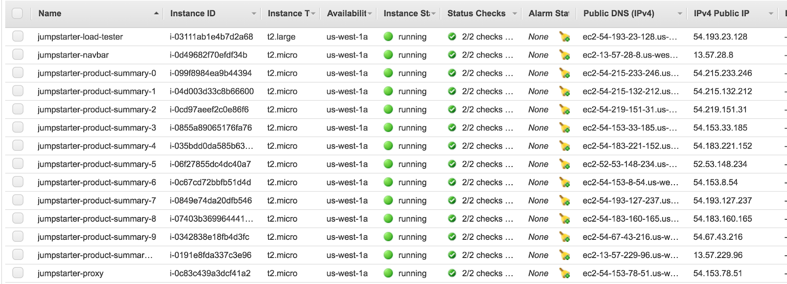

On a recent project, I led the optimization and development of the backend architecture for a crowfunding application.
The two main goals of my work were to:

1. Improve server response time (latency measured in milliseconds)
2. Handle a large amount of simultaneous requests made to the server (requests per second, RPS with an error rate below 0.01%)

Having inherited a minimum viable product, there was little work I had to do on the frontend, but you can see it in action here:

  <iframe width="1120" height="630" src="https://player.vimeo.com/video/267902202" frameborder="0" allow="autoplay; encrypted-media" webkitallowfullscreen mozallowfullscreen allowfullscreen></iframe>

I began by identifying the key areas to explore for optimization:
1. Database server: query optimization and database selection 
2. Single web server: code and node optimization, vertical scaling
3. Deployment: multiple servers and load balancing, horizontal scaling

In the end I was able to achieve:
1. An average query time of 0.1 ms (1,000-100,000x improvement for certain queries)
2. An average server response time of 14 ms (2x improvement)
3. The ability for the server to handle 7.3K RPS (20x improvement)

You can read about each of the steps I took in more detail below.

---
### 1) Improving Query Speeds using Column Indexing & Database Selection: Postgres vs. MongoDB
Starting with the database, I benchmarked the existing MongoDB and found that there were several queries that were taking an abnormal amount of time. The slowest operations were related to finding or counting all objects that meet a certain criteria (e.g. Category, City, State). 

After careful consideration, I decided to reimagine the database schema in a more structured way, mapping entity relationships and how the data could be restructured for efficient query handling. I decided to benchmark Postgres, seeding the database with 10M fake projects and 100M fake users, in order to see if a relational database could outperform the NoSQL counterpart.

The next step that I took was to [index](https://en.wikipedia.org/wiki/Database_index) the most important columns that I was performing operations on: `creator_id, category, city and state`. Additionally, I [denormalized](https://en.wikipedia.org/wiki/Denormalization) some of the data, duplicating count data in several tables.
This offered huge improvements in the query read speeds, as shown in the tables below, although at the expense of writing extra data.

As a result, I ripped out MongoDB entirely, replacing it with Postgres both for the speed and structure.

*Notably, Postgres was a also a tad faster at certain operations before indexing, but still extremely slow at the same operations that MongoDB had struggled with.*

The last three steps I took were to restructure what data the frontend was actually pulling before rendering:
1. I limited project and search queries to 12, recognizing that not all the data needed to be pulled each time, but only 12 at time.
2. Caching the count of certain fields such as count of projects belonging to each category, and count of projects by city and state.

| Select Project by Id                                                                   | Before    | After     |
|----------------------------------------------------------------------------------------|-----------|-----------|
| select * from projects where id = 5000000;                                             | 1.447 ms  |           |
| db.projects.find( {_id: 5000000} );                                                    | 8 ms      |           |

| Select User by Id                                                                      | Before    | After     |
|----------------------------------------------------------------------------------------|-----------|-----------|
| select * from users where id = 50000000;                                               | 1.297 ms  |           |
| db.users.find( {_id: 50000000} );                                                      | 0 ms      |           |

| Count Projects Created by a User                                                       | Before    | After     |
|----------------------------------------------------------------------------------------|-----------|-----------|
| select count(*) from projects where creator_id = 47488361;                             | 17325 ms  | 0.997 ms  |
| db.projects.count( {creator_id: 47498119} );                                           | 26954 ms  | 7 ms      |

| Select Projects in a Category                                                          | Before    | After     |
|----------------------------------------------------------------------------------------|-----------|-----------|
| select * from projects where category = ‘Games’;                                       | 10659 ms  | 2680 ms   |
| db.projects.find( {category: “Games”} );                                               | 23262 ms  | 15239 ms  |

| Select First 12 Projects in a Category                                                 | Before    | After     |
|----------------------------------------------------------------------------------------|-----------|-----------|
| select * from projects where category = ‘Games’ limit 12;                              | 4.083 ms  | 4.021 ms  |
| db.projects.find( {category: “Games”} ).limit 12;                                      | 1 ms      | 2 ms      |

| Count Projects in a Category                                                           | Before    | After     |
|----------------------------------------------------------------------------------------|-----------|-----------|
| select count(*) from projects where category = ‘Games’;                                | 7660 ms   | 2531 ms   |
| db.projects.count( {category: “Games”} );                                              | 21325 ms  | 148 ms    |

| Select Projects by State, City                                                         | Before    | After     |
|----------------------------------------------------------------------------------------|-----------|-----------|
| select * from projects where state = ‘Rhode Island’ and city = ‘Herzogland’;           | 7509 ms   | 3.006 ms  |
| db.users.find( {state: “Tennessee”}, {city: “West Elwinland”} );                       | 137540 ms | 140932 ms |

| Select First 12 Projects by State, City                                                | Before    | After     |
|----------------------------------------------------------------------------------------|-----------|-----------|
| select * from projects where state = ‘Rhode Island’ and city = ‘Herzogland’ limit 12’; | 11116 ms  | 0.102 ms  |
| db.users.find( {state: “Tennessee”}, {city: “West Elwinland”} ).limit(12);             | 4 ms      | 2 ms      |

| Count Projects by State, City                                                          | Before    | After     |
|----------------------------------------------------------------------------------------|-----------|-----------|
| select count(*) from projects where state = ‘Rhode Island’ and city = ‘Herzogland’;    | 11024 ms  | 0.086 ms  |
| db.users.count( {state: “Tennessee”}, {city: “West Elwinland”} );                      | 35200 ms  | 78 ms     |

---
### 2) Optimizing Server Locally before Deployment

The next few steps I took were related to optimizing the performance of my single server before deployment.

I began by load testing my server using [Artillery.io](https://artillery.io/) and [wrk](https://github.com/wg/wrk) to serve as a benchmark for future tests.
I ran into some limitations using Artillery, since it didn't support offer [multicore support](https://artillery.io/blog/artillery-20-preview-multicore), so I alternatively built a simple [test script](https://github.com/jump-starter/johnny-product-summary-module/blob/master/wrk.lua) for wrk using Lua.

1. Firstly, I made sure to optimize how node was running on my computer using [node clusters](https://nodejs.org/api/cluster.html). Being that a single node instance runs in a single thread, this doubled the requests my server could handle by effectively using twice as much processing power on my computer.
2. Secondly, I implemented [Redis](https://redis.io/) to create an in-memory cache, inspired from the work I had done on improving database query speeds. I designed my test script so that 20% of the pages saw 80% of the traffic, emulating a likely real-world scenario, and thus Redis did have a noticeable impact.
3. Lastly, I made sure Node was [running in production mode](https://expressjs.com/en/advanced/best-practice-performance.html#set-node_env-to-production), speeding up Express.

*Note: Latency: x% refers to the latency in which x% of requests finished*

|                               | Requests / Second | # of Errors | Avg Latency (ms) | Latency: 50% | Latency: 75% | Latency: 90% | Latency: 99% |
|-------------------------------|-------------------|-------------|------------------|--------------|--------------|--------------|--------------|
| Before Optimizatons           | 1107.22           | 0           | 36.4             | 34.04        | 36.47        | 42.69        | 78.85        |
| 1) Node Clustering            | 2484.24           | 0           | 19.45            | 13.84        | 20.88        | 30.6         | 93.53        |
| 2) Redis Caching              | 3300.69           | 0           | 15.66            | 10.98        | 16.75        | 25.24        | 90.03        |
| 3) Setting Node to Production | 3664.98           | 0           | 14.9             | 9.55         | 15.52        | 24.24        | 97.34        |

---
### 3) Load Testing while Horizontally Scaling

The last step in optimization was in deployment.

I deployed my application to AWS [EC2](https://aws.amazon.com/ec2/) instances using [Docker containers](https://www.ybrikman.com/writing/2015/11/11/running-docker-aws-ground-up/) and Amazon's [RDS](https://aws.amazon.com/rds/) to host the database.

Using Amazon's [Elastic Load Balancing](https://docs.aws.amazon.com/elasticloadbalancing/latest/userguide/what-is-load-balancing.html), I began scaling my server horizontally, noticing that it was much more cost efficient than vertically scaling my single server. Amazon made this quite easy, as all I had to do was to create an [Amazon Machine Image](https://docs.aws.amazon.com/AWSEC2/latest/UserGuide/AMIs.html), spin up a new instance and restart my Docker containers.

The results were phenomenal:

| # of t2.micro Instances | Requests / Second | # of Errors | Avg Latency (ms) | Latency: 50% | Latency: 75% | Latency: 90% | Latency: 99% |
|-------------------------|-------------------|-------------|------------------|--------------|--------------|--------------|--------------|
| 1                       | 1382.21           | 0           | 30.15            | 26.49        | 29.44        | 35.48        | 98.75        |
| 2                       | 2498.4            | 0           | 18.56            | 15.4         | 21.08        | 28.48        | 96.68        |
| 3                       | 3535.65           | 0           | 15.63            | 9.8          | 14.82        | 26.13        | 116.34       |
| 4                       | 4380.72           | 3           | 14.23            | 7.43         | 12.51        | 27.87        | 109.54       |
| 5                       | 5366.41           | 1           | 13.74            | 6.05         | 12.09        | 29.99        | 137.95       |
| 6                       | 6001.27           | 1           | 14.15            | 5.21         | 11.25        | 33.65        | 163          |
| 7                       | 6244.99           | 42          | 19.5             | 4.48         | 9.27         | 48.05        | 239.2        |
| 8                       | 6781.59           | 62          | 23.01            | 4.1          | 8.62         | 56.6         | 295.32       |
| 9                       | 7130.03           | 73          | 17.84            | 3.94         | 7.79         | 41.37        | 235.69       |
| 10                      | 7382.94           | 100         | 14.13            | 3.84         | 7.43         | 35           | 197.7        |

----
### The Final Results!

New Relic helped confirm my benchmarked data, as shown below:

#### 10 EC2 Instances + 1 RDS Database + Load Balancer = 7.3K RPS!

Although I was able to speed up server response time 2x and allow my server to handle an immense amount of requests, there are still more improvements to make!
Next steps would be to:
1. Remove Docker from the deployment process altogether
2. Look into read/write speeds of my single database
3. Explore [Unix domain sockets](https://en.wikipedia.org/wiki/Unix_domain_socket) as an alternative to TCP

Link to the full repo: [https://github.com/jump-starter/](https://github.com/jump-starter/)