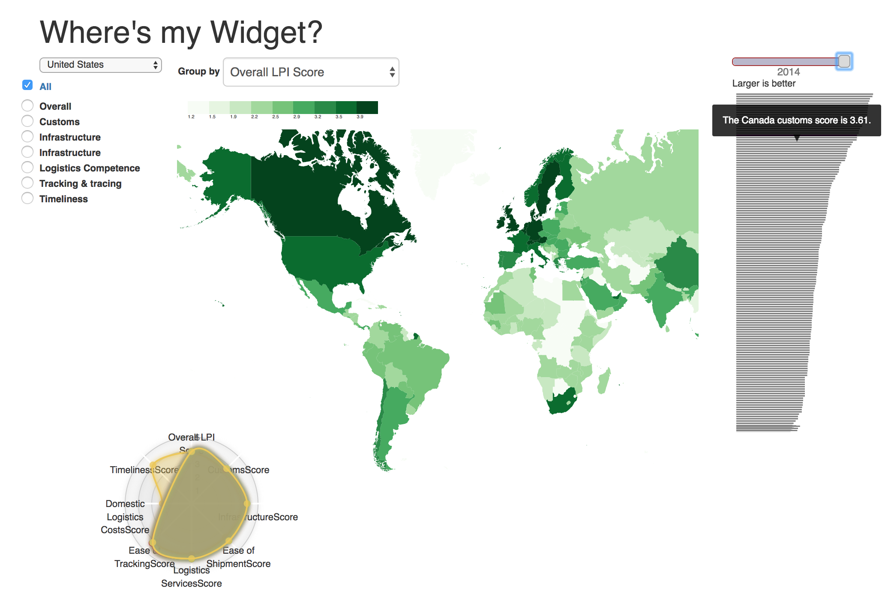

For this project we analyzed data from the [World Bank logistics performance index](https://lpi.worldbank.org/).

The primary questions we wanted to answer were:
* What's a given countries ability to trade?
* With other countries? 
* Within region? 
* What direction is the country moving?

Link to the project: [http://harvard-team-pivot.github.io/cs171project/](http://harvard-team-pivot.github.io/cs171project/)

----
**The primary steps we took were**:
1. Brainstorming and sketching ideas as a group
2. Storyboarding and eliciting feedback
3. Data cleaning
4. Implementation
5. Cleanup and next steps

More about our process:
[https://github.com/harvard-team-pivot/cs171project](https://github.com/harvard-team-pivot/cs171project)

---
*Notes on Data Cleaning Process and Implementation:*

Data was exported from excel as csv. There was one file exported for each year. Headers were multi-line. Edited csv to reflect accurate column headers. Second csv header set updated since data changed from 2007-2010. The data change was not due to collection of new information, but the addition of summary data.

Consolidated data, as working with four datasets didn't make much sense. The 2007 dataset was missing some summary data that needed to be imputed. While reviewing the data in the chrome javascript console, I also identified a discrepancy year over year in the number of records.

Added them all to a single dataset for the time being. Pushed to github with the allData array available for prototyping. Added each dataset to allData array.

1. **Added bar chart**: Sorted it by highest score to lowest. Made it grey per expert evaluation feedback. Added it to bootstrap container.
2. **Added radar chart** from [here](http://bl.ocks.org/nbremer/21746a9668ffdf6d8242): Tweaking data to work with it. I got the axes in there own variable. Able to filter the axes, need to let the function accept scope or rank.
3. **Added choropleth map** modeled after [here](https://bl.ocks.org/mbostock/4060606). Added the ability to filter by metric, and set us up for the ability to filter by year (currently set to 2014).
